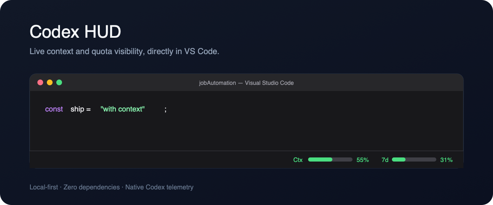

# Codex HUD for VS Code

[](https://github.com/RohanSi4/codex-hud-vscode/actions/workflows/ci.yml)
[](LICENSE)
[](https://code.visualstudio.com/)

Live Codex context and account-usage meters in the VS Code status bar.



```text
Ctx ██████░░░░ 55%   7d ███░░░░░░░ 31%
```

Codex HUD reads Codex's native local `token_count` events. The values are not
estimated, and session data never leaves your machine.

## Why

Long agentic sessions fail quietly when context or quota is nearly exhausted.
Codex exposes that information, but it is easy to miss while working in VS
Code. Codex HUD keeps both constraints visible without adding another window.

## Features

- Live context-window consumption
- Primary account quota consumption, including 5-hour and 7-day windows
- Hover details with token counts and reset times
- Green, yellow, and red thresholds at 65% and 85%
- Configurable meter width and refresh interval
- Click-to-open detail picker and manual refresh command
- Zero runtime dependencies and zero network requests

## Install

Download `codex-hud-0.1.0.vsix` from the
[latest release](https://github.com/RohanSi4/codex-hud-vscode/releases/latest),
then run:

```bash
code --install-extension codex-hud-0.1.0.vsix
```

Reload VS Code once. The two meters appear on the right side of the status bar
after Codex writes its first token event.

## Commands and settings

Open the Command Palette to run:

- `Codex HUD: Show Details`
- `Codex HUD: Refresh`

Settings:

| Setting | Default | Description |
| --- | ---: | --- |
| `codexHud.barWidth` | `10` | Characters in each meter |
| `codexHud.refreshIntervalMs` | `2000` | Refresh interval in milliseconds |

## How it works

```text
Codex session → ~/.codex/sessions/*.jsonl → local parser → VS Code status bar
```

The extension finds the most recently updated local Codex session, reads only
the tail of that file, and extracts the newest `token_count` event. It does not
invoke Codex, call an API, inspect credentials, or upload prompts and tool
output.

When multiple Codex sessions are active at once, the most recently updated
session wins. This keeps the implementation fast and predictable across VS
Code windows.

## Development

```bash
npm run check
npm test
npx @vscode/vsce package
```

See [CONTRIBUTING.md](CONTRIBUTING.md) for the Extension Development Host
workflow.

## Acknowledgements

Inspired by [jarrodwatts/claude-hud](https://github.com/jarrodwatts/claude-hud),
which demonstrated how useful persistent context visibility is for coding
agents. This project is an independent VS Code implementation for OpenAI Codex
and does not share Claude HUD's runtime or statusline architecture.

Codex HUD is an unofficial community project and is not affiliated with or
endorsed by OpenAI. "OpenAI" and "Codex" are trademarks of their respective
owner.
